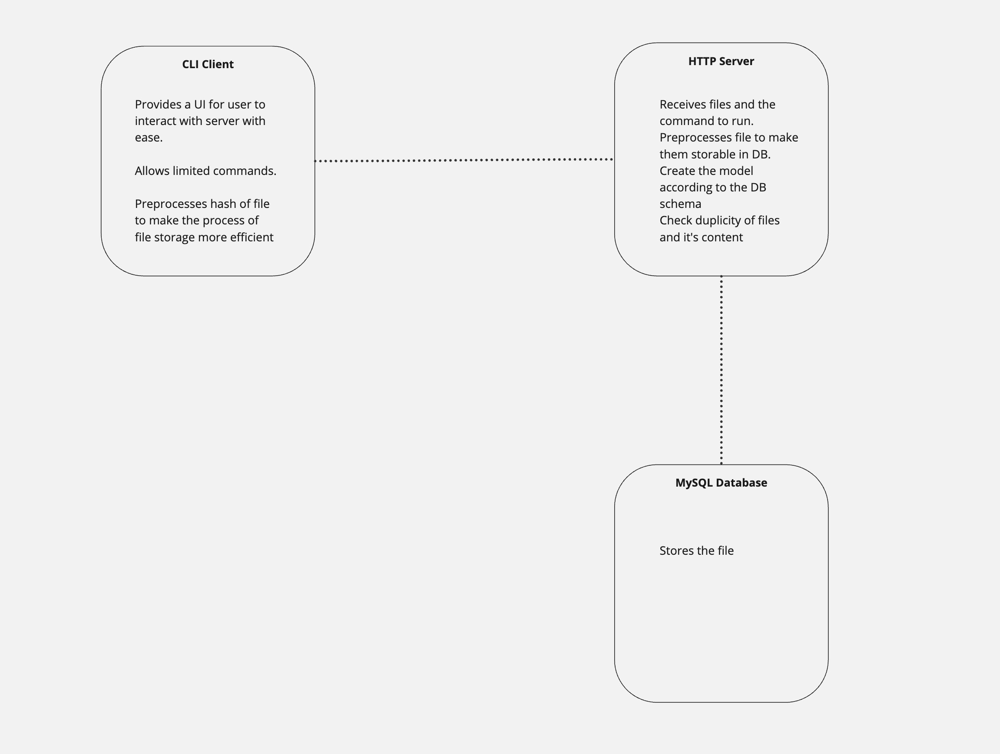

# File Storage Server and Client
This is a simple HTTP server and command line client written in go used to store plain text files.

The code is divided into two parts. Both of these parts need to be executed separately for the code to work. These two parts are
### 1. Server
This is the backend of the program. This handles the db and the logic for the file storing system. It has a http server which listens to port 2021. This server is connected to a MySQl database
### 2. CLI Client
CLI Client is a program which acts as a mediator between the server and user. Instead of hitting the API directly, the client helps in making this process a streamlined process.
The client supports the command for which API routes are defined.




## Dependencies
1. MySQL database 

## Installation
> Note: You will need to create a local MySQL database.
1. Create an .env file. Copy .env.sample and replace the placeholder which correct credentials
2. Install the dependencies by running the following command
```
go mod download
```
3. Build the server
```
go build main.go
```
4. Run the server
```
./main
```
5. Open a new terminal window and go to `client` directory
```
cd client
```
6. Build the client
```
go build client.go
```
7. Run the client
```
./client
```

## Future Scope
The current code has a large scope of improvement. Possible improvement are.
1. Authentication and authorization
Currently, any one with the URL of server can access it. Authentication and authorization will help in this.
2. Support for more file formats
The current server supports only txt files. It can be improved to support storing of other file formats.
3. Size limit
Currently, size limit is very less. It can be improved to send continous stream of packets for large files.

## License
GPL-3.0 license

## Tests
There is test each for client and main.

To run tests for main. Enter the following commands
```
go build main_test.go
go test .
```

Similarly, to run tests for client. Enter the following commands
```
cd client
go build client_test.go
go test .
```

